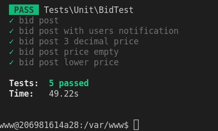

# Assessment

A collection of script for Assessment project.

### Structure Explanation
- `docker` is the docker files and docker-compose file placed
  - `assessment-app` is the application container Dockerfile placed
  - `assessment-app-mysql` is the mysql container needed configuration files placed
  - `assessment-app-nginx` is the nginx webserver container needed configuration files placed
- `ac_skillassessment1-main` is the application sourcecode folder

### How to start
*This setup is based on ubuntu to develop, could try out on mac, might varies*

- Clone this repository locally

- Kindly install run the bash script `docker/prerequisites.sh` in your ubuntu machine / cloud vm, it includes creating new docker network for this assessment project.

After cloning those repositories:
  - Go to docker folder: `cd docker`
  - Spin up the containers
  ```
  docker-compose up -d --build`
  ```
  - Run below command for `assessment-app-mysql` container for mysql database creation
  ```
  docker exec app-mysql mysql -u root -psecret -e "create database assessment;"
  ```
  - Run below command for `assessment-app` container for create `.env`
  ```
  docker exec app cp .env.example .env
  ```
  - Run below command for `assessment-app` container on storage link, for export download usage (if storage file needed)
  ```
  docker exec app php artisan storage:link
  ```
  - Run below command for `assessment-app` container on migrations
  ```
  docker exec app php artisan migrate
  ```

### Hosting Details
- Access laravel api with `http://localhost/api`

### Changes on the Unittests
- Added new folder `tests/Feature`, else running phpunit.xml configurations will scream for folder not exits

- In test `tests/Unit/BidTest.php`, Changes made on Line 60, 68, 77, 79, `assertSessionHasErrors` will not work as it throws no sessions available, hence I change it to `assertJsonValidationErrors`

- Before running the test, kindly truncate the `notifications` table

- Unittests result as below <br />




## Queues
- This app needs queue to run notification process

- If you are not using container to run this app, kindly run below code for the queue to listen
```
php artisan queue:listen --queue=notifications
```